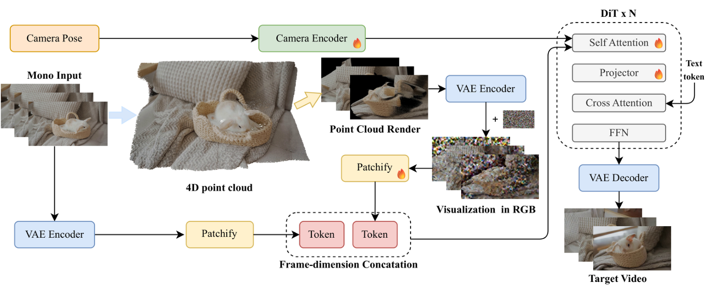

# Manifold4D: Denoising on Point Cloud Rendered Manifolds for Video Re-shooting

[](https://yongxuqixiang.github.io/Manifold4D-Project-Page/)
[](https://arxiv.org/abs/2608.28174)
[](https://huggingface.co/manifoldtech/Manifold4D)

[Yongqi Mao](https://yongxuqixiang.github.io/yongqi/)<sup>1,2</sup>, Zijia Dai<sup>2,3</sup>, Zhishuo Liu<sup>2,4</sup>, Wei Xu<sup>2</sup>, Kaiwei Wang<sup>1</sup>, Guotao Meng<sup>2</sup><br/>
<sup>1</sup>Zhejiang University, <sup>2</sup>[Manifold Tech](https://www.3dmanifold.com/), <sup>3</sup>ShanghaiTech University, <sup>4</sup>University of Cambridge

**Manifold4D** is a *video re-shooting* framework: given a single monocular
source video, it re-renders the underlying dynamic scene from arbitrary novel
camera trajectories. The core idea is to denoise on a point-cloud-rendered
manifold — a coarse 3D proxy of the scene rendered from the target view —
instead of raw video pixels, so long-range camera control stays consistent
with the scene's 3D geometry.

This repository contains the **inference pipeline and released model weights**
only (training code is not included).

## Updates

- **2026/09/23:** Inference code and model weights have been released!
- **2026/10/09:** Three bundled demo scenes + a lightweight demo entry
  (`python -m manifold4d.demo`) — test the model without VGGT-Omega / SAM3 /
  Qwen2.5-VL. Full preprocessed evaluation scenes (with depth) are released
  on [HuggingFace](https://huggingface.co/datasets/manifoldtech/Manifold4D-Eval).

## Demo


https://github.com/user-attachments/assets/563fd3dd-7802-4db8-afe0-8a92d6db8ebd


## Overview

From a single source video, the pipeline runs end-to-end:

1. **Preprocess** — VGGT-Omega reconstruction of the source video
   (depth + cameras + intrinsics), Qwen2.5-VL captioning, T5 text encoding,
   SAM3 dynamic-object segmentation.
2. **Trajectory** — novel camera trajectories via coverage-filtered 6-DOF
   search in the source reference frame (or supply your own TUM files).
3. **Generate** — for each trajectory: render the point-cloud proxy from the
   target view, run the Manifold4D diffusion model (Wan2.1-T2V-14B base with
   our trained modules), and decode the final video.

## Pipeline



## Installation

Requirements: **Python >= 3.10** and one CUDA GPU (we use A100-80GB; the
diffusion loop peaks around 47 GB at 480x832).

### 1. This repository

Verified stack (fresh-install tested): **Python 3.10 · torch 2.8.0+cu128 ·
flash-attn 2.8.3.post1 · diffusers 0.40**. Install in this order — torch
and flash-attn first, then the remaining dependencies:

```bash
git clone https://github.com/ManifoldTechLtd/Manifold4D.git
cd Manifold4D

# 1) torch, cu128 build — do not let plain PyPI resolve this for you:
#    its newest wheels (2.14+cu130) bundle a cuDNN whose conv3d fails on
#    some driver/GPU combos inside the Wan2.1 VAE.
pip install torch==2.8.0 torchvision==0.23.0 --index-url https://download.pytorch.org/whl/cu128

# 2) flash-attn, prebuilt wheel — no compiler needed (adjust cp310 to
#    your Python version; other torch/CUDA builds on the releases page)
pip install https://github.com/Dao-AILab/flash-attention/releases/download/v2.8.3.post1/flash_attn-2.8.3.post1+cu12torch2.8cxx11abiTRUE-cp310-cp310-linux_x86_64.whl

# 3) remaining dependencies
pip install -r requirements.txt
```

**flash-attn is required at full resolution.** The 14B model's
self-attention runs on the compiled
[flash-attn](https://github.com/Dao-AILab/flash-attention) kernels.
Without the package, inference falls back to PyTorch's
`scaled_dot_product_attention` (announced by an import-time warning),
which needs far more memory and OOMs on 80 GB GPUs at 480x832. If your
torch/Python combination has no prebuilt wheel, build flash-attn from
source per its README.

### 2. External dependencies

All external dependencies live under `external/` (see
[`external/README.md`](external/README.md); overridable via the `WAN_SRC`,
`VGGT_ROOT`, `SAM3_ROOT` environment variables).

| Dependency                                                  | Purpose                                             | Setup                                                                                    |
| ----------------------------------------------------------- | --------------------------------------------------- | ---------------------------------------------------------------------------------------- |
| [Wan2.1](https://github.com/Wan-Video/Wan2.1)                | Base model code (`wan.modules.*`, T5, schedulers) | `git clone https://github.com/Wan-Video/Wan2.1 external/Wan2.1`                        |
| [VGGT-Omega](https://github.com/facebookresearch/vggt-omega) | Source-video geometry reconstruction                | `git clone https://github.com/facebookresearch/vggt-omega external/vggt-omega-main`    |
| SAM3                                                        | Dynamic-object segmentation                         | clone to`external/sam3` (weights at `external/sam3/ckpt/sam3.1/sam3.1_multiplex.pt`) |

### 3. Model weights

Download the following weights:

| Weights                          | Target path                                       | Source                                                                                                                                                                    |
| -------------------------------- | ------------------------------------------------- | ------------------------------------------------------------------------------------------------------------------------------------------------------------------------- |
| Manifold4D modules (our release) | `checkpoints/manifold4d/`                       | [manifoldtech/Manifold4D](https://huggingface.co/manifoldtech/Manifold4D) — run `bash scripts/download_weights.sh`                                                      |
| Wan2.1-T2V-14B (base)            | `checkpoints/wan/Wan2.1-T2V-14B/`               | [Wan-AI/Wan2.1-T2V-14B](https://huggingface.co/Wan-AI/Wan2.1-T2V-14B) — or `bash scripts/download_weights.sh --with-base` (diffusion weights + `Wan2.1_VAE.pth` + T5) |
| VGGT-Omega 1B                    | `checkpoints/vggt_omega_1b_512.pt`              | [facebook/VGGT-Omega](https://huggingface.co/facebook/VGGT-Omega) (gated; request access)                                                                                  |
| SAM3.1                           | `external/sam3/ckpt/sam3.1/sam3.1_multiplex.pt` | per the SAM3 repo                                                                                                                                                         |
| Qwen2.5-VL-7B                    | `checkpoints/Qwen2.5-VL-7B-Instruct`            | [Qwen/Qwen2.5-VL-7B-Instruct](https://huggingface.co/Qwen/Qwen2.5-VL-7B-Instruct) — scene captioning (or hand-write `caption.txt`)                                      |

## Quick demo (no preprocessing)

Three pre-built demo scenes ship with the repository under
[`assets/demo/`](assets/demo/) — `snowboard` (from our own captures),
`woman-phone` and `rabbit-basket` (from the Vista4D evaluation set).
Each bundle contains the exact conditioning inputs the model consumes:
source video, point-cloud render in the target view, alpha/motion masks,
camera trajectories, and the pre-encoded T5 text embedding. You can run the
released model **without** VGGT-Omega, SAM3, or Qwen2.5-VL — only the
inference dependencies above and the two weight sets (Manifold4D modules +
Wan2.1-T2V-14B base) are needed:

```bash
python -m manifold4d.demo \
    --demo_dir    assets/demo/snowboard \
    --checkpoint  checkpoints/manifold4d \
    --output_dir  output/demo_snowboard \
    --num_steps 20
```

| Scene | Frames | Content |
| ------------------------------------------------ | ------ | ------------------------------- |
| [`snowboard`](assets/demo/snowboard) | 65 | snowboarder on a sunny slope |
| [`woman-phone`](assets/demo/woman-phone) | 49 | woman on the phone, lateral move |
| [`rabbit-basket`](assets/demo/rabbit-basket) | 49 | white rabbit in a basket, crane move |

To demo your own scene this way, export a bundle from a preprocessed scene
with `scripts/export_demo_scene.py` (see its docstring).

The full preprocessed evaluation scenes used in the paper — including the
VGGT-Omega depth (`predictions.npz`) that the bundles above omit, plus all
novel-view trajectories — are released on HuggingFace at
[manifoldtech/Manifold4D-Eval](https://huggingface.co/datasets/manifoldtech/Manifold4D-Eval).

## Quick start

The pipeline has two steps: **preprocess** the source video, then **generate**
novel-view videos.

### Step 1 — Preprocess

Arrange each source video as a folder of numbered frames, then run the
pipeline (it dispatches each stage to its own conda env via
`conda run`; see `--vggt_env/--qwen_env/--t5_env/--sam3_env`):

```bash
# extract frames from your video
ffmpeg -i my_videos/clip.mp4 -q:v 2 data/raw/clip/frame_%06d.png

# VGGT-Omega → Qwen caption → T5 → SAM3 masks → novel-view trajectories
python scripts/preprocess/run_vggt_caption_t5_sam3_traj.py \
    --data_root data/raw \
    --names clip
```

This produces a scene directory `data/raw/clip_vggt/` plus three novel-view
trajectories under `data/val_traj/clip/{f1,f2,f3}/`.

### Step 2 — Generate

```bash
python -m manifold4d.generate \
    --scene_dir   data/raw/clip_vggt \
    --trajectory  data/val_traj/clip/f1/trajectory_new/trajectory.npz \
    --checkpoint  checkpoints/manifold4d \
    --output_dir  output/clip_f1 \
    --num_steps 20
```

### Output layout

```
data/raw/clip_vggt/                   # preprocess scene output (Step 1)
    frames/000000.png ...             # source frames
    predictions.npz                   # VGGT-Omega depth/intrinsics
    trajectory/trajectory.npz         # source camera trajectory
    mask_dynamic/000000.png ...       # SAM3 dynamic masks
    caption.txt                       # Qwen2.5-VL caption
    text_embedding.pt                 # T5 text embedding
data/val_traj/clip/                   # novel-view trajectories
    f1/trajectory_new/trajectory.npz
    f2/trajectory_new/trajectory.npz
    f3/trajectory_new/trajectory.npz
output/clip_f1/                       # generation output (Step 2)
    video.mp4                         # the generated video
    video_render.mp4                  # point-cloud render conditioning (debug)
    cameras.npz                       # target-view cameras
```

## Citation

If you find this work useful, please cite:

```bibtex
@article{manifold4d,
  title   = {Manifold4D: Denoising on Point Cloud Rendered Manifolds for Video Re-shooting},
  author  = {Mao, Yongqi and Dai, Zijia and Liu, Zhishuo and Xu, Wei and Wang, Kaiwei and Meng, Guotao},
  journal = {arXiv preprint arXiv:2608.28174},
  year    = {2026}
}
```

## License

The code in this repository is released under the
[Apache License 2.0](LICENSE). The released model weights are for
non-commercial research use. Base models (Wan2.1, VGGT-Omega, SAM3, Qwen2.5)
follow their respective licenses.

## Acknowledgements

We build upon the excellent open-source works
[Wan2.1](https://github.com/Wan-Video/Wan2.1),
[VGGT-Omega](https://github.com/facebookresearch/vggt-omega),
[SAM3](https://github.com/facebookresearch/sam3),
[Qwen2.5-VL](https://github.com/QwenLM/Qwen2.5-VL),
[Vista4D](https://github.com/Eyeline-Labs/Vista4D), and
[ReCamMaster](https://github.com/KlingAIResearch/ReCamMaster).
