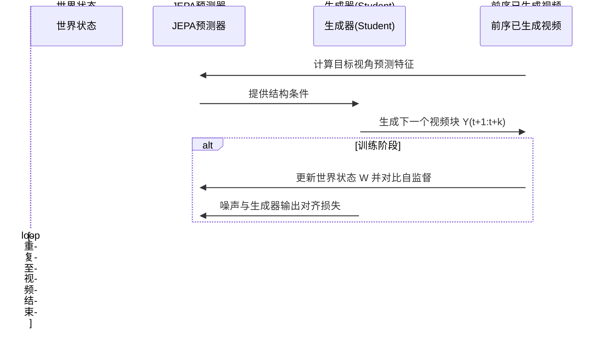
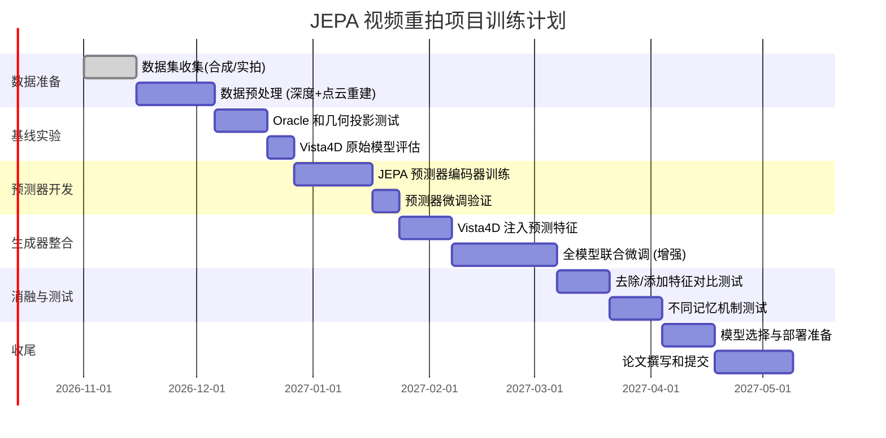

# 执行摘要

近年来，**联合嵌入预测结构**（JEPA）在自监督视频表征学习中取得重大进展，其**预测式表征**擅长捕捉运动和物理动力学。同时，**视频重拍（video reshooting）或新视角生成**成为视频生成领域的新热点，方法往往通过对单目视频进行**重建**和**基于几何的渲染条件**，再结合扩散模型或流匹配生成器来控制相机运动。两者结合的核心思想，是利用 JEPA 产生的**世界状态表征**来引导视频生成，从而在保证物理一致性的同时准确地控制生成视角。

在本报告中，我们首先梳理了 JEPA 相关文献（I-JEPA、V-JEPA 家族、seq-JEPA、Gaussian-JEPA 等）以及最新的视频重拍方法（Vista4D、Manifold4D、MoCam、MV-Forcing、EditStream、Go-with-the-Track、LDO、PhysVideoGenerator 等），并比较它们的**表征类型**、**预测目标**、**条件方式**、**时间处理**、**训练目标**和**生成接口**等要素。通过文献归纳，我们发现将 JEPA 的预测目标从未来时刻扩展到**跨视角**预测具有独特挑战：遮挡导致的不可观测区域多解性、源视角内容与新视角几何之间的信息错配、长时序一致性以及几何-外观冲突等问题亟待解决。

基于这些分析，我们提出了三条具体的研究方案：**（1）JEPA 表征作为结构条件 + 现有生成器（Vista4D/Manifold4D）**，通过**先验／Oracle→预测→生成**管道将 JEPA 预测插入生成器；**（2）联合训练 JEPA 世界模型 + 几何流匹配起点（Flow-Init）**，即把几何点云视为生成初始状态，与 JEPA 表征一起联合训练扩散或流匹配模型；**（3）面向长视频的串流/自回归 JEPA**，借鉴 EditStream、MV-Forcing 等方案，将 JEPA 模型改为因果形式、引入长期记忆，支持连续长序列中的多视角生成。每个方案包含方法概述、架构草图、训练目标、预期优缺点、最小实验和评价指标等细节。

最后，我们列出了相关数据集及基准（多视角同步视频、单目长视频、合成数据等）以及可复现基线和开源代码，以指导方案的实现与对比实验。我们认为，下一步的研究重点应集中于**跨视角一致的世界状态预测**：即在重拍任务中从单视角视频推断出一个具有一致语义的场景状态，并使其能通过查询不同目标相机生成一致的多视角视频。为此，我们建议结合 JEPA 式结构预测与几何条件生成，共同优化遮挡区域的推断、多时序对齐和物体运动的保真度。

# 方法综述


## JEPA 及其扩展

- **I-JEPA**：首个应用于图像的 JEPA 模型，通过从图像的一个“上下文块”预测同图像中其他目标块的表征来学习语义级特征。它不依赖手工数据增强，而依靠 Mask 策略产生预测任务。这为后续 JEPA 形式的视图表征学习奠定了基础。
- **V-JEPA / V-JEPA2 / V-JEPA 2.1**：扩展到视频的 JEPA 模型，预测视频中被遮挡的帧特征而非像素。V-JEPA2 提出使用视频长短期上下文，同时采用时序掩码预测；V-JEPA2.1 进一步增加了对可见 token 的自监督（强制保持局部结构）和多层次监督，以获得更稠密、结构化的特征。这些模型能够捕捉运动语义和深度信息，在机器人操作与深度估计任务上表现出色，但主要作为静态表征学习，未直接考虑相机变化或视频生成。
- **seq-JEPA**：一种世界建模框架，引入序列预测和行动（视角变换）条件。模型同时学习适合不变任务（分类）和等变任务（物体定位）的两个表征，一个 Transformer 编码短序列视图+动作，预测下一个视图的特征。该工作表明，结合序列和动作对 JEPA 表征的学习能改进视觉“等变性”，但其主攻的是视觉表示质量，对新视角合成的增量仍需评估。
- **Gaussian-JEPA**：将 JEPA 应用于 3DGaussianSplat（3DGS）表示学习。在该工作中，**Gaussian Token**（含几何与外观属性的高斯原语）被分块，模型从可见高斯块预测被遮挡块的表征。目标是学习与高斯渲染强关联的高质量隐特征，以支持可渲染形状补全等任务。与传统重构预训练相比，Gaussian-JEPA 在零样本部分观察等实验中表明隐预测可以学习更鲁棒的 3D 表征。它与视频重拍的关系较弱，但展示了 JEPA 在 3D 表示（非体素）的可行性，为跨时空预测提供借鉴。
- **PhysVideoGenerator**：这是一项“概念性框架”研究，将物理特征预测注入视频扩散模型中。作者使用一个轻量预测器 PredictorP，从扩散潜空间中回归由**预训练 V-JEPA 2**提取的物理特征（“物理令牌”），并通过跨注意力注入到 DiT 生成器中。核心贡献在于：证明扩散潜在空间中含有可恢复的 V-JEPA 特征信息，并且多任务联合训练稳定。此工作并非直接用于视频重拍，而是通过 JEPA 特征提升视频生成物理合理性的一种尝试，显示了“从生成潜空间预测自监督特征”技术的可行性。 
- **LDO（Predictive Structure Improves Video Diffusion Dynamics）**：一种**世界模型指导**视频生成的框架。LDO 利用一个**冻结的 V-JEPA 2 模型**作为教师，将其预测动态结构的能力注入到预训练视频扩散模型中。具体地，一方面在扩散网络内部对齐其特征与 V-JEPA 预测的动态变换（“动态对齐”）；另一方面用 V-JEPA 给生成视频打分，把视频生成作为强化学习中的“世界一致性”奖励。LDO 不修改生成器结构，而是作为“后训练信号”优化，证明了 JEPA 表征能够补充扩散模型对物理一致性的理解。尽管 LDO 不是直接的重拍方法，但它强调了“世界预测与生成目标不匹配”带来的问题：仅像素重建的扩散目标忽略了物体运动规律，而 JEPA 式预测则可补强此弱点。


## 视频重拍与新视角生成方法

下表概述了近期典型重拍方法的关键属性：


| 方法                          | 表征类型                   | 预测目标               | 条件方式                  | 时间处理                | 训练目标                        | 生成器接口                 | 可解释性/可视化        |
| --------------------------- | ---------------------- | ------------------ | --------------------- | ------------------- | --------------------------- | --------------------- | --------------- |
| **Vista4D**                 | 4D 点云 + 原视频视觉特征        | 最终视频帧像素/光流         | 相机位姿 + 源视频            | 分块推理 + 跨块记忆         | Flow consistency, VAE重建     | 扩散/流匹配（DiT + 4D令牌）    | 高（可视化点云、遮挡）     |
| **Manifold4D**              | 4D 点云 + 噪声场（flow-init） | 流场（velocity field） | 点云渲染输入 + 源视频视觉特征      | 单段 + 增量长视频          | Flow-matching, distillation | 直接流场生成                | 高（直接利用几何起点）     |
| **TrajectoryCrafter/Gen3C** | 4D 点云渲染 (打碎输入帧)        | 像素                 | 渲染帧 + (交叉注意) 源视频      | 单段                  | 像素重建                        | 扩散（DiT+渲染条件）          | 中（渲染可视，易受深度错）   |
| **MoCam**                   | 隐特征（DiT 令牌） + 渲染帧      | 像素                 | 时间分段：先几何渲染输入，再交叉注意后改进 | 单段                  | 分阶段监督                       | 扩散（时间调度下的DiT）         | 中（分阶段几何/细节）     |
| **Go-with-the-Track**       | 隐特征 + 点跟踪嵌入            | 像素/合成视频            | 多参考图像 + 对应跟踪点         | 静态/动态混合             | 扩散回归                        | 扩散（DiT + 参考+跟踪令牌）     | 中高（点跟踪可视化对应）    |
| **MV-Forcing**              | 隐特征 + 3D 重建模型          | 像素/多视角视频           | 前一视角重建的三维几何 + 文本提示    | 多视角自回归              | DMD + 自我强化（跨视角）             | 扩散（Few-step student）  | 高（4D重建桥接渲染）     |
| **EditStream**              | 隐特征（DiT Transformer）   | 视频帧像素（多任务：生成/编辑）   | 文本、图像、视频、遮罩、深度、多视角    | 串流 (autoregressive) | Flow/GPM/DMD distillation   | 扩散（DiT + 双类型拼接）       | 低（偏关注编辑质量）      |
| **Vista4D教练**（ReCamMaster）  | 4D 点云渲染 (强条件)          | 像素                 | 点云渲染 + 隐编码            | 单段                  | 像素重建                        | 扩散                    | 中（容易复制渲染错误）     |
| **DIT-X / TrajCraft**       | 隐特征（Diffu）             | 像素                 | 位姿编码 + 源视频            | 单段                  | 像素重建                        | 扩散                    | 低（无几何显式条件）      |
| **LDO**                     | V-JEPA 特征              | 无（损失教学习）           | 无                     | 无                   | 特征对齐 + 强化学习 (V-JEPA 评分)     | 无                     | 高（依赖深度世界模型）     |
| **PhysVideoGen**            | V-JEPA 2 特征            | 视频像素               | 扩散潜在 + 预训练V-JEPA特征    | 单段                  | 特征回归 + 多任务对齐                | 扩散 (DiT + cross-attn) | 中（需要V-JEPA可视分析） |
| **Gaussian-JEPA**           | 3D高斯分量特征               | 高斯属性               | 无（自监督）                | N/A                 | 隐表征回归                       | 无                     | 高（3D形状特征）       |
| **seq-JEPA**                | 隐特征（分不变 vs 等变）         | 下一个视角特征            | 视图序列 + 变换动作           | 多段自回归               | 对比学习 + 特征预测                 | 无                     | 中（结构显式，关注表示质量）  |


这些方法侧重点各有不同：如 Vista4D/Manifold4D **显式引入几何点云**以保证相机控制精度；EditStream 则**统一多种任务**，兼顾生成与交互性但复杂度高；MV-Forcing 结合长视角自回归和多视图一致性，目标是**任意长度多视角视频**。它们之间的比较表明，不同方案在**表征层次（3D几何 vs 2D特征）**、**预测输出（像素 vs 特征 vs 世界状态）**以及**条件方式（直接融入 vs 早期注入 vs 混合）**上有明显差异，从而影响了生成质量和一致性。

# 技术挑战与开放问题

通过对上述文献的梳理，可以提炼出将 JEPA 机制用于视频重拍时面临的若干关键挑战与待解决的问题（不完全归纳）：

1. **遮挡与可观测区域多解性**：单目视频对新视角隐藏区域的信息缺失，多解性导致预测目标不唯一。JEPA 模型可能学到平均化的补全，而生成器倾向于产生清晰内容，两者冲突。如何在两者间权衡、明确预测的确切“不见”的内容，是核心难题。
2. **预测模型与生成器条件失配**：如 PhysVideoGen 和 LDO 所示，JEPA 特征若直接注入扩散过程，需要解决生成模型和自监督表征**训练时分布差异**问题。特别是若使用“教师”特征辅助训练，必须避免训练时泄露目标信息（即保证测试时生成器的输入与训练时一致分布）。
3. **长时序一致性与递归错误累积**：Vista4D/Manifold4D 表示长视频为多个块、并用几何记忆贯通。引入 JEPA 后，跨块一致性更难保证：比如多个时间段各自独立预测时可能产生不一致的补全。需设计机制维持长期物理与语义连贯性。
4. **几何-外观冲突**：点云渲染常存在精度误差和孔洞。生成器在跟随几何时可能无意识地加强这些瑕疵。如何让模型在依赖几何约束的同时修正它、或根据上下文平滑填补，是设计难点。
5. **条件信息利用和依赖**：例如 MoCam表明，需要在生成早期利用几何特征，在后期依赖外观细节。但判定何时“切换”并非显式可控；而若源视频本身随时间发生变化，用哪帧信息做条件也不清晰。这导致相机条件下推理方式（像 TrajCrafter 只早期, Vista4D 视为对等条件, Manifold4D 注入初始噪声等）间权衡困难。
6. **效率与推理成本**：EditStream、MV-Forcing 等证明，面向交互/长视频生成的模型需要串流或自回归变体。但现有 JEPA/扩散通道通常是离线双向注意力，转为 few-step 自回归模型（如 EditStream 的 Velocity Moment Matching）需复杂蒸馏策略。联合考虑 JEPA 表征生成以及保持实时性，工程难度高。
7. **数据需求与标注**：视频重拍训练需摄像机轨迹、多视角视频等数据，标注难度大。EditStream 通过合成和渲染增强视频物理监督；MV-Forcing 结合合成/真实长序列。JEPA 本身可用无监督预训练，但跨视角监督（oracle 特征）及多相机数据仍稀缺。
8. **评估指标缺失**：当前评测常用像素重投影误差、FID/LPIPS 等图像质量指标。但视频重拍需评估**物理一致性**、**运动同步**、**相机控制误差**。如 EditStream 引入新的 V2VCameraPose 基准；Vista4D 提出用户研究和VBench分数。标准化多维度指标仍待完善。
9. **生成高质量的多视角编辑**：如 Go-with-the-Track 所示，联合多参考图像与运动控制能解决部分问题。但当场景动态且无参考外观时（如真实视频中非静态物体只出现一次），如何保证跨参考物体插值的一致性仍需探索。
10. **模块可解释性与调试**：虽然 JEPA 和几何渲染可视化帮助分析，“黑盒”扩散过程难以解释。设计易于诊断的组件（如显式世界状态变量）有助于定位错误，但也增加复杂度。如何在保证效果的同时保留可检验性是研究重点。

综上，这些挑战既来自 **物理预测（JEPA）与像素生成（扩散）的双重目标冲突**，也源自长视频场景、遮挡区域不确定性、信息传递方式等核心问题。下一节我们结合以上思考，提出三种可行的研究方案。  

# 可行研究方案

为了充分发挥 JEPA 结构预测在视频重拍任务中的潜力，我们提出以下三个具体方案，每个方案针对不同侧重点，并给出架构草图、训练目标、预期优缺点、最小实验及评价指标等要素。

## 方案 1：JEPA 结构条件 + Vista4D/Manifold4D 生成（先验/Oracle→预测→生成）

> 代码实现、设计取舍和可运行命令见 [方案 1 实现说明](jepa_scheme1_implementation.md)。当前为 Vista4D 实验链路，以下预期收益尚未经本仓库的真实多视角实验验证。

**方法概述：** 在此方案中，我们将 JEPA 模型作为**辅助结构特征**提供给现有的重拍生成器（如 Vista4D、Manifold4D）。具体流程为：使用 V-JEPA（或密集 JEPA）对目标相机视角进行特征预测，将这些预测的结构特征与原有的几何输入一起作为生成器的额外条件，从而引导生成器在遮挡区域更准确重现世界状态。也即“先验/Oracle→预测→生成”式管道（图略），其中**Oracle**为全局、完备目标视角特征，**预测**为仅利用源视频信息预测得到的特征。

$$
\begin{aligned}
W_{1:T} &= \text{聚合}(\text{源视频 } S_{1:T}, \text{相机 } C^{s}_{1:T}), \\
\widehat{Z}^{\star}_{1:T} &= P_{\phi}(W_{1:T}, Q(C^{\star}_{1:T}), M_{\text{query}}), \\
Y_{1:T} &\sim v_{\theta}(x_{s}, s;\, S, R^{\star}, C^{\star}, \widehat{Z}^{\star})
\end{aligned}
$$

其中 $W_{1:T}$ 表示世界状态表征（附加空间坐标信息的点云和特征），$Q(C^{\star})$ 为目标相机查询编码，$\widehat{Z}^{\star}$ 是 JEPA 预测的目标视角特征，$v_{\theta}$ 表示原有的视频生成器（如 Vista4D 或 Manifold4D 流匹配模型）。我们将 $\widehat{Z}^{\star}$ 通过**交叉注意力注入**生成器。例如，可以在 DiT 的某些层使用 $H' = \text{CrossAttn}(H, \widehat{Z}^{\star})$ 并加权到主通路。这一步需要对时空对齐和分辨率进行插值，确保结构条件与生成器的 latent 匹配。

**主要改动与训练：** 需要训练一个预测器 $P_{\phi}$，从点云和源视频推断目标视角的密集特征。首先，建议以**冻结 JEPA 编码器**（如 V-JEPA 2.1）作为教师，使用多视角视频数据监督 $P_{\phi}$。训练损失包括从目标视角视频提取的特征回归损失（L2）以及常规的 GEOM+TEXTURE一致性损失。在初步实验阶段，可先用**真实目标特征（Oracle）**直接接入生成器，验证其改善重拍质量的潜力；若有利，则进一步用 $P_{\phi}$ 预测替代。

**预期优点与风险：** 

- 优点：保留了 Vista4D/Manifold4D 的成熟机制，只新增结构条件通道；可以独立评估 JEPA 特征的有效性（通过 ORACLE 实验检验）；如果成功，能**增强复杂遮挡区域**的预测能力。
- 风险：预测器可能学习不到比简单几何投影更好的信息（“能否战胜直接投影？”）；生成器训练与实际推理条件分布差异（需确保同时训练生成器使用预测器输出，而非只用教师特征）；还需防止训练时泄露目标信息。若预测精度不足，可能导致多余的干扰甚至结果下降。

**最小可行实验：** 

1. **Oracle 条件测试**：将真实目标视频通过 V-JEPA 编码后注入生成器（保留其它条件不变），对比未使用结构条件的基线。检查直观效果和指标（FID、LPIPS、相机控制误差）是否提升。
2. **预测 vs 直接投影对照**：训练 $P_{\phi}$ 来预测目标视角特征，同时比较以下几种输入给生成器：
  - 无额外条件（基线）
  - 源视频 JEPA 特征（拼接注意力，但无投影）
  - 几何投影后再编码的 JEPA 特征
  - $P_{\phi}$ 预测特征
   观察生成质量和一致性是否由预测而非直投影带来优势。
3. **相机控制验证**：在不同程度的视角变化下测试以上模型，评估抖动、一致性和新遮挡区域重建质量的变化趋势。

**评价指标：** 相机控制误差（如旋转/平移 RMSE）、视频质量（FID/LPIPS）、运动一致性、遮挡区域重建准确度（使用目标真值的 IoU、SSIM 等）和用户感知。重点观察 JEPA 条件在大视角/复杂遮挡下的表现。

如图所示，对于给定单目输入和目标轨迹，Manifold4D 等方法将点云渲染（Rendered Point Cloud）与源视频分别作为条件，而我们方案将额外加入 JEPA 预测的目标视角特征，通过交叉注意力注入到生成器。结果示例（下图）显示，在复杂动态场景中，加入结构条件能减轻模型盲目追随有孔洞的渲染所致的误差，使生成结果更贴合预期运动轨迹。

## 方案 2：联合训练 JEPA 世界模型 + 几何 Flow-Init

**方法概述：** 本方案尝试**内生联合学习**：将几何点云渲染与 JEPA 表征**同时**作为扩散模型的条件，从而让模型**从一开始就知道世界结构**。具体思路：Manifold4D 中将渲染加入流场起始噪声的做法与 V-JEPA 式表征相结合。即在流匹配生成器中，不仅在初始噪声（flow-init）中注入点云渲染信号，也在后续 denoise 过程通过 cross-attention 增加 JEPA 特征条件。

架构草图大致如左图：首先通过 SfM / 深度估计得到源视频的 4D 点云，并渲染至目标相机。初始化生成器的第一个预测分布时，将渲染图加到噪声上（如 Manifold4D 所做），使得生成过程本质上从带有几何先验的分布出发。然后，在 DiT 的中后层加入对 JEPA 预测特征的 cross-attention，使生成过程既固定基础几何，也能依照世界模型调整细节。

**训练目标与数据：** 需要联合优化预测器 $P_{\phi}$ 和生成器 $v_{\theta}$。可采用**双目标**：一方面，让生成器学习从新的 flow-init 生成视频（保持原始 flow-matching 损失），另一方面让预测器学习目标视角表征（如方案1）。训练可分两步：先冻结生成器，仅训练 $P_{\phi}$（类似方案1）；然后联合微调，使得生成器在采样时同时考虑预估特征。Flow-init 的加入需要在训练时同步使用，否则训练-推理条件不一致。数据可使用多视角同步视频或渲染数据集，每个样本包含源视频、渲染重投影（和可选的目标视频监督）。生成器损失主要为 DiT 的流匹配损失；预测器损失为 JEPA 特征回归。

**预期优点与风险：** 

- 优点：几何信息从生成初态就引入，模型更易学习世界结构；JEPA 条件专注于补足几何不足和预测运动。理论上，这种设计可最大程度利用点云信息，并让生成器主要聚焦细节与运动。
- 风险：由于条件过多，可能引入更多冲突：若渲染有误，若预测不准，模型可纠错空间有限；且双重条件可能使训练更难收敛。联合训练所需资源（数据、计算）更大。此外，衡量 Flow-init 与 JEPA 条件各自贡献不易，需要严格对照实验。

**最小可行实验：** 

1. **Flow-init 单独验证**：比较 Manifold4D（只用渲染init）和原 Vista4D；重点看是否已有性能提升，作为基线。
2. **仅 JEPA 交叉注意力验证**：类似方案1，只注入 JEPA 条件（无 Flow-init），验证 JEPA 条件独立效果。
3. **联合条件训练**：在 Manifold4D 上增加 JEPA 交叉注意力，训练两种模式：训练时使用真实目标特征 vs 预测特征；实验区分流程是否收敛及性能变化。
4. **消融研究**：人为损坏渲染或源视频内容（例如遮挡掉部分区域），观察模型是否依靠另一条件重建缺失内容，从而评估两者的互补性。

**评价指标：** 与方案1类似，同时监控相机控制（Rotation/Translation Error）和重现率。如条件充足，无条件（oracle）下效果最优，对比预测下的差距也应给出。如果 Flow-init 结合 JEPA 条件后能显著提升控制精度或对遮挡区域的重建准确度，则验证了该思路。

```mermaid
flowchart LR
    subgraph 世界表征预测
      A[源视频与点云] -->|SfM/投影| B(几何渲染)
      A -->|JEPA编码| C{JEPA 表征}
    end
    subgraph 生成器 (Flow-Matching)
      B -.-> D[初始化噪声 + 渲染]
      C -->|交叉注意力| E[生成过程]
      D --> E
      E --> F[最终视频输出]
    end
    style A fill:#ddf,stroke:#333,stroke-width:2px
    style F fill:#fdd,stroke:#333,stroke-width:2px
```


## 方案 3：面向长视频的串流/自回归 JEPA（结合 EditStream/MV-Forcing）

**方法概述：** 该方案旨在将 JEPA 结构预测集成入**因果/自回归视频生成**流程，以处理长时序视频。思路借鉴 EditStream 等串流模型：首先将一个强大的双向视频模型（融合相机控制条件）蒸馏为一个**few-step 自回归学生**；同时，在学生模型的输入侧加入世界模型预测机制。关键是设计**时序递归的联合训练**：对每个生成块 $Y_{t+1:t+k}$，在生成前先通过 JEPA（或 world model）对其条件进行预测，然后生成视频块，再将该块反馈给下一步预测。

例如，使用 MV-Forcing 的思想，可以按步骤执行：以已生成视频（或源视频）重建世界状态并预测下一个视角的条件，然后输入给几步采样的学生模型。序列上通过**Spatio-Temporal Self-Forcing**（同时跨时间和跨视角自我使用输出作为训练目标）来消除分布漂移。同理，EditStream 的自强制（self-forcing）和速度矩匹配（VMM）技术可用于稳定训练，使学生流畅地处理连续生成，不出现块间抖动。

**模型架构草图：** 可视化为一个循环流程：在每个时间块 $t:t+k$ 生成开始前，用 JEPA/world predictor 从前块 $1:t-1$ 积累的状态 $W_{1:t-1}$ 和源数据推断当前视角要素 $\widehat{Z}_{t:t+k}$，然后作为生成器的新条件。生成后，把生成的真实/预测块加入输入历史，以供下个时间段预测与生成。此循环可嵌入多视角自回归扩散模型中，如下图所示。




**训练目标与数据：** 首先，需要一个预训练的双向教师模型与数据集：可使用 Vista4D/Manifold4D 等短段重拍模型来生成合成视频-重拍对，或采用 MV-Forcing 的自回归联合训练数据。然后应用类似 **Velocity Moment Matching**和 **Spatio-Temporal DMD**的蒸馏策略：同时对时间递归和视角递归进行分布匹配。训练目标包括常规的扩散重建损失，以及 JEPA 预测特征与真实特征之间的距离损失，和可能的稳定性奖励（如 LDO 的世界模型评分）。该方案数据需求最高：需要连贯的多段视频，最好包含不同摄像机轨迹。

**预期优点与风险：** 

- 优点：一旦成功，可输出**任意长度、持续交互**的视频；模型在线生成能力较强，更适应编辑和实时控制。结合 JEPA 世界模型后，理论上输出可以保持更长时程的一致性和物理可靠性。
- 风险：极高的训练复杂度和工程挑战；需训练一系列蒸馏环节（如 EditStream）且每一步都可能失败；另外，需要解决**误差累积**（若每块预测有误，则小误差可能放大）和**曝光偏差**。数据质量要求也高，尤其需要长序列多视角数据，标注成本很高。

**最小可行实验：**

1. **自回归单步验证**：在单一视角的长视频条件下，先仅使用 JEPA 特征预测单帧或短块输出，并评估生成器输出是否比无预测更连贯。
2. **上视下视交替测试**：模拟 MV-Forcing 数据，训练模型生成一连串两个相机视角的视频，然后测试其多视角顺序一致性。
3. **简化任务（单物体场景）**：从简单的动态场景开始（如跳舞人物或转动物体），结合小型 JEPA 世界模型测试是否能保持动作连贯并按相机控制规律生成新视角。
4. **性能对比**：与短序列方法（方案1/2）进行比较，关注长序列中出现的漂移和不一致问题，验证串流架构的效用。

**评价指标：** 需要长时序性能指标：例如块间连续性（不连续性率）、累积光流差错、长期运动一致性，以及相机控制精度。也可使用 MV-Forcing 等方案定义的“时空自强制”对齐分数。由于缺少标准基准，可设计**回放-交叉验证**：对同一视频进行不同步平移/旋转，相机控制正确性和动态一致性为主要关注点。

# 实验计划、数据与资源


## 数据集与采集

- **多视角动态视频**：Ego4D、Vista4D 采用的多摄像头数据；MultiCamVideo可用于相机轨迹控制。**
- **单目长视频**：DAVIS、Vimeo-90K 等短视频，可合成多段。可使用 Deformable-NeRF 或其他影视重构技术获取虚拟视角以作为训练数据。
- **合成数据**：各类渲染数据（如 Kubric、SAPIEN 等），用于构建物理一致的训练对，如 EditStream 中用 HPSim生成。
- **数据增强**：对现有的短视频数据应用随机相机轨迹（参考 MultiCamVideo 处理方式），合成额外视角对。

据需和易用性考虑，我们可分阶段使用数据：先用合成数据（控制性强）验证方法概念，再过渡到真实视频。评估时可用 Vista4D 提供的用户评测数据集，以及诸如 VBench、Re-Scene 等环境建立新基准。

## 可复现基线与代码

- **Vista4D / Manifold4D**：开源代码（未公开或仅Demo）目前暂无，此两篇均未公开正式代码，需自己重实现或借鉴相关工作（可参考 ReCamMaster 开源）。
- **MV-Forcing**：Gal Fiebelman 已发布 ECCV 2026 论文，可查找作者网页或 github。代码待关注。
- **EditStream**：Adobe 发布论文，开源项目网页，可能提供权重或示例（需查找 retina/Adobe发布）。
- **Go-with-the-Track**：Eyeline Labs 已开源 GitHub。
- **V-JEPA 2.1**：Meta AI 已发布 GitHub。
- **PhysVideoGenerator/LDO**：为概念性预印本，未见开源。
- **其他基线**：ReCamMaster、TrajectoryCrafter、GEN3C 已在文中提及，需自行复现或使用作者提供的模型（部分仅作为参考性能对比）。

可复现的关键对照实验包括：有无 JEPA 条件、投影 vs 学习预测、不同 flow-init 方案（VisNet/Manifold4D）、不同蒸馏策略（自强制 vs VMM），这些均需在相同训练框架下比较。建议使用常见指标（FID/LPIPS、PE/PS等）和自定义一致性评价。

## 时序图与架构示意

- **综览架构**：如上所示的 Mermaid 图，展示 JEPA 表征和几何渲染如何注入生成器流程。  
- **训练流程**：可设计一个时序图说明师生网络蒸馏过程（EditStream 样式）。  
- **数据流动**：如方案1/2流程图，说明观测流（视频→点云→表征→预测→生成）的各阶段。

{width=100%}

*图：Manifold4D 等方法的视频重拍示例。输入单目视频与目标相机轨迹，点云渲染（Rendered Point Cloud）与源视频分别作为条件。我们的方案将额外加入 JEPA 预测结构特征，引导生成器正确补全遮挡区域。左列为原视频帧，中央为点云渲染（蓝框）；右图展示不同方法在目标视角的生成结果（Ours 新方案结果框线突出）。*

# 下一步行动（建议）

1. **实现并验证 JEPA 条件的效果**：立即尝试方案1中的 Oracle 试验。提取目标帧的 V-JEPA 特征，注入已有 Vista4D/Manifold4D 或简单扩散模型，检查生成质量变化。这将迅速指示 JEPA 结构条件的实用性和接口可行性。
2. **数据准备与小规模实验**：构造一个合成或合成+真实混合的数据集（如简单的动态物体场景），用于快速迭代方案2中联合训练的效果。使用 SSDD 等可公开获取的动态场景视频集进行初步验证。
3. **基准与指标确定**：针对重拍任务，先行定义和实现评估指标，如相机控制误差和时序连贯性测量，并搭建对照实验环境，以便客观比较方案差异与改进空间。


# 执行摘要

为了将 JEPA 思想融入 Vista4D/Manifold4D 以实现视频重新拍摄，需要大规模计算资源和丰富的多视角视频数据。Vista4D 基于 Wan2.1-14B（14B 参数）的视频扩散模型，需要**至少数十GB 显存**（Wan2.1-14B FP16 模型参数已达 ~28GB），因此训练和推理需用高端 GPU（如 NVIDIA A100/H100）构建的多GPU集群。此外，还需 SSD 存储多视角视频数据集和点云预处理缓存。本文按照原型、小规模和全规模训练三个阶段，分别给出硬件规格（GPU 类型与数量、CPU、内存、网络、NVMe SSD等）和资源预算（低/中/高），并估算相应的存储、带宽需求；列出可用的多视角视频数据集（如 MultiCamVideo）以及必要的合成数据方案；最后评估训练/推理时长与成本（GPU小时、存储和网络费用），并给出关键实验设计所需的最小与推荐配置。报告辅以硬件对比表和两张 mermaid 图（系统组件关系图、训练时序图）。  

# 假设与约束

- **预算等级**：分为**低预算（实验室级）**、**中等预算（小型集群级）**、**高预算（企业级超算级）**三种场景。低预算可采用单机或少量 GPU；高预算可使用多节点、最新型号 GPUs。  
- **多机/分布式**：可视需要使用多机多卡并行训练，需考虑网络带宽（如 InfiniBand 100Gbps+）和分布式通信协议（NCCL、ZeRO 等）。  
- **合成数据**：由于公开多视角动态视频数据匮乏，允许使用合成渲染数据（如 Unreal/Blender 生成的 MultiCamVideo）补充。所有公开数据需遵守许可，私有视频数据需做好隐私保护。  
- **数据分辨率与长度**：参考 Vista4D 训练使用的视频长约3秒（49–81帧）；目标可考虑 720p (1280×720) 或更高。批量大小（如1–4个视频）受 GPU 显存限制，需要梯度累积等手段。  
- **软件要求**：使用 PyTorch 2.x、CUDA 12.8 环境，需安装如 FlashAttention、XFormers 等加速库。Diffusion模型（DiT）和 SAM3、Pi3X 等模块也需对应依赖。


# 硬件需求


| 阶段           | 主要用途        | GPU (型号×数量)                             | CPU (核数) | 内存(RAM)    | 网络带宽        | NVMe/SSD                                  | 单卡显存 | 云实例示例                                                    | 本地设备示例            | 功耗 & 冷却       |
| ------------ | ----------- | --------------------------------------- | -------- | ---------- | ----------- | ----------------------------------------- | ---- | -------------------------------------------------------- | ----------------- | ------------- |
| 原型/小规模 （低预算） | 功能验证、单样本测试  | 1×NVIDIA RTX 4090 (24GB) 或 1×A100 40GB  | 16核      | 64GB       | ~1–10 Gbps  | 1×1–2TB NVMe (PCIe4x3，读速≥3GB/s，IOPS≥250k) | 24GB | AWS g5.12xlarge (4×A10G) ； 本地：配1×RTX4090的工作站             | ~500W (总计)        |               |
| 中等训练 （中等预算）  | 规模训练、迭代开发   | 4×NVIDIA A100 80GB (或 H100 80GB)        | 32–64核   | 256–512GB  | 25–100 Gbps | 2×2–4TB NVMe (读速≥6GB/s，IOPS≥500k)         | 80GB | AWS p4d.24xlarge (8×A100-40GB)； AWS p5.24xlarge (4×H100) | 本地: 4×A100/SXM服务器 | ~2–3 kW       |
| 全量训练 （高预算）   | 大规模训练、跨节点并行 | 8+×NVIDIA H100 80GB (或 DGX H100 8×H100) | 64–128核  | 512–1024GB | 100+ Gbps   | 多个NVMe阵列或并行文件系统 (如 Lustre, 10TB+，IOPS≥1M) | 80GB | AWS p5.48xlarge (8×H100 NVL)； DGX H100 (8×H100 SXM)      | 本地: 企业集群多节点       | ~5–10 kW (节点) |


- **GPU**：由于 Wan2.1-14B 模型参数巨大（14B）且需生成长视频，必须采用高显存卡。1×4090(24GB)只能做小批量测试，完整训练建议至少4×A100-80GB或更高（以托管 49 帧视频的 diffusion 网络和 VGA 模型）。H100 80GB 性能更强。示例云实例：AWS p4d.24xlarge（8×A100-40GB）或 p5.48xlarge（8×H100-80GB）。  
- **CPU/内存**：数据预处理（点云重建 Pi3X/DA3、SAM3 分割）、数据加载等对 CPU 也有要求。建议中等阶段使用 32–64 核高主频 CPU（如 AMD EPYC、Intel Xeon），全量阶段可上到 64+核。内存需匹配 GPU：每颗 A100 80GB 约配 64–128GB RAM，多卡服务器推荐 256–1024GB RAM，以缓存数据和多进程。  
- **网络带宽**：单机阶段可用 1–10Gbps 以下载数据；多机并行训练时需高速互连（Mellanox IB 100Gbps+），以支持分布式通信（NCCL）和跨节点数据访问。  
- **NVMe/SSD**：需大容量、低延迟 SSD 存储数据集和中间产物。原型可用 1–2TB NVMe（PCIe4，顺序读速>3GB/s，IOPS>250k），中等训练建议 2×4TB NVMe RAID 或更快盘；全量训练可配企业级存储阵列（NVMe SSD 或并行文件系统）总容量 ≥10TB，IOPS≥1M，保证并行数据读取不瓶颈。  
- **GPU显存**：单卡需 ≥24GB (4090) 或 40–80GB (A100/H100)。即使 80GB，生成长视频/使用大批时也可能溢出，应使用混合精度(amp)和梯度累积。同时可利用多卡或分布式并行将模型拆分。  
- **功耗与散热**：RTX 4090 TDP ~450W，H100 SXM ~700W（可调）、H100 PCIe ~400W，A100 80GB ~400W。一个4卡节点可能高达 ~2–3 kW，8卡则 ~5–6 kW。需对应企业级电源与机房冷却，确保工作负载连续运行。

> 注：以上配置仅供参考。实际选择应考虑批量大小（譬如每批 2–4 个 49帧视频）、模型精度（FP16 或更低精度）、源视频分辨率（672×384 至 1280×720）等因素。若模型采用 Mixture-of-Experts、模型并行等技术，显存可分散需求。  


# 存储与带宽

- **训练数据**：以 MultiCamVideo（333GB）为基准。若使用其他数据，如 10 个全高清视频 (5min), 10台相机同时拍摄，每秒30帧，10个视角共 ~5min=9000帧/镜头，总帧数9万帧，每帧1080p RGB~3MB，则约270GB；多场景累积可达 TB 级。综合考虑，需要准备至少 1–5TB 原始数据存储。  
- **中间数据缓存**：  
  - **点云/深度**：每个视频需通过 Pi3X/DA3 生成深度图和 SAM 分割，再重建为 4D 点云。深度图（672×384 浮点）约1MB/帧，81帧约81MB；彩色图+Seg（RGB+mask） ~1–2MB/帧。点云数据可按帧或全程缓存（可能数十MB）。建议将重建的点云和渲染结果（target-view color/depth）缓存为二进制，以便后续加速。整个缓存量视场景长度而定，典型单视频<1GB。  
  - **JEPA 特征**：如预先提取目标视角的编码特征（如 V-JEPA 特征图），每帧可能数百MB（视编码器架构和分辨率而定）；但可选择只缓存关键层或压缩后存储，典型<1GB/视频。
- **模型检查点**：Wan2.1-14B 基础模型 FP16 ~28GB，Vista4D 增量和附加模块估计 <5GB；每次保存约 30–35GB。若采用 ZeRO Stage 3，可拆分存储但文件合并后一致大小。建议**每训练 1k–5k 步**保存一次，长期训练可预计数十次检查点。  
- **日志与可视化**：训练日志 (TensorBoard、图片等) 较小。即使记录多种指标和若干验证集视频，1次全训练过程日志量也应 <10GB。推荐定期备份，并可配置云日志（如 AWS S3）。  
- **存储带宽与并发**：  
  - **读带宽**：多GPU训练时，每个 GPU 需要不断加载新视频帧和参考图像。若同时加载 8 条流，带宽需求可能数百MB/s；NVMe SSD 可支持 >3GB/s 连续读，足够支撑。  
  - **写带宽**：主要写检查点和日志，间断性工作，一般 SSD 足够。若分布式训练，每节点本地 SSD 写入检查点后，可能需要将其汇总或异步上传到中央存储。  
  - **IOPS**：随机访问主要在载入图像文件和元数据。1TB NVMe 的 IOPS 通常数十万，可满足。若数据集非常零散，可考虑预取或将所有帧合并存储到大型文件以减少随机开销。


# 数据集清单

我们重点需要**同步多视角动态视频数据**。现有公开资源较少，可考虑以下：  

- **MultiCamVideo（ReCamMaster 数据集）**：13,600 个动态场景，每场景由 10 台相机同步拍摄 81 帧（1280×1280, 15FPS），共136,000 视频，总量 ~333GB。许可 Apache-2.0，可用于训练相机控制和视角一致性。优点：多样环境（室内外、高质量场景）、真实感强；缺点：为合成渲染，不含真实成像噪声。适合**oracle 训练**（可直接注入目标视角的真实编码）和**预测训练**（用源摄像机视角预测其他视角）。  
- **动态场景合成**：若无现成多视角素材，可自行生成。方法：利用游戏/渲染引擎（Unreal Engine、Blender 等）组合 3D 场景、角色和动作（如 MultiCamVideo 做法），按随机轨迹设置多相机并同步渲染。优点：可控、自动生成大量数据；缺点：开发成本高、可能与真实世界存在域差距。  
- **Real 多机实拍**：例如 CMU Panoptic Studio（500+相机捕捉多人舞蹈）或 Dynamic EventNeRF（6台相机捕捉动作，共18分钟）。此类数据质量真实，有复杂动作和遮挡，但多为研究内部用途，不易获得或许可受限。可参考但主要依赖合成数据。  
- **合成动态运动**：利用 3D 人体动作库（如 Mixamo、Human3.6M）和场景库生成多视角序列。或者在物理仿真中（如车内碰撞模拟）使用多相机拍摄。  
- **其他资源**：一般视频数据集（如 NTU RGB+D、Kinetics、YouTube-VOS）缺乏摄像机参数和多视角同步信息，不直接适用。**建议**根据需求，自主录制实验数据：搭建 2–4 台视频相机（固定或带运动跟踪），捕捉特定动作场景（如人体行为或物体互动），并通过校准获取相机外参，形成多视角视频。

各数据集应注明许可（开源、需申请或不可用）、时长、帧数、分辨率和相机数。例如：  


| 数据集                 | 场景类型               | 时长/帧数               | 分辨率                     | 相机数  | 许可         | 优势 / 适用                               | 缺点               |
| ------------------- | ------------------ | ------------------- | ----------------------- | ---- | ---------- | ------------------------------------- | ---------------- |
| MultiCamVideo       | 合成室内外场景            | 13,600×81帧（15FPS）   | 1280×1280               | 10   | Apache-2.0 | 大规模、多场景、一致轨迹，有镜头外参；训练 Vista4D、验证几何一致性 | 非真实图像，无传感器噪声     |
| Dynamic EventNeRF   | 真实动态场景（事件+RGB）     | 16 条×∼18min，共 6 摄像头 | 触发相机约 346×260，RGB视频具体未知 | 6    | 未公布        | 真实拍摄、多样动作、夜光下                         | 数据量小，主要事件相机数据需处理 |
| Panoptic Studio（引用） | 大规模室内多人人体          | ∼1小时×500+摄像头        | HD 视频                   | >500 | 研究使用，需申请   | 超高密度多视角                               | 硬件复杂，非自由获取       |
| 合成场景（自制）            | 动作/物理仿真            | 可定制，TB量级            | 可达 1280×720+            | 可定制  | 可公开/内部使用   | 灵活生成、域可控                              | 开发成本高，需要3D素材库    |
| 实验室多机捕捉（自制）         | 具体动作场景（如桌面交互、人手传物） | 数分钟多视角同步            | HD                      | 2–4  | 自己标注或许可    | 真实感强、可用作质控                            | 量级小，需校准和标注       |


# 训练与推理成本估算

- **GPU小时数**：  
  - *原型/探索*：如只做少量短片生成或特征分析，单卡 RTX4090 可在数百小时内完成示例测试。  
  - *中等训练*：假设4×A100进行预训练/微调，批量大小调整后（等效批2-4），训练约3万步（Vista4D 384p49_checkpoint）需 约2–4k GPU·h（8卡并行）。  
  - *全量训练*：8×GPU并行训练大模型，数万步训练可能需 1万 GPU·h 以上（若使用 H100 并行效率更高）。例如：30000 步×（单步0.2min@8卡）≈1000 GPU·h。
- **存储成本**：  
  - 数据（1–5TB）放在云端（如 AWS S3）约 0.02/GB·月，则 1TB/月 ~20，5TB/月 ~100。加上检查点存储（数十GB，可忽略）和日志。
- **网络流量**：  
  - 若云端训练，上传/下载数据量取决于训练轮次；例如每个 epoch 需读 333GB（MultiCamVideo）×所有视角，每卡并行；可利用数据管道方式避免反复重复传输。  
  - 持续多节点训练时，内部网络需高速（建议 100Gbps+），外部网络费用（如 AWS 出站流量）在训练内不显著。
- **计算费用**：以 AWS 为例：  
  - p4d.24xlarge（8×A100-40GB）约 32/小时；p5.48xlarge（8×H100-80GB）约 60/小时。  
  - 如果以 8×A100 为例，4k GPU·h ≈ 500 GPU·d ≈ 60 天×32 = 7680，8k GPU·h ≈ 15360。  
  - 混合精度 (FP16/FP8) 可节省显存和一部分计算，但使用的实例费率不变。
- **节省策略**：  
  - **混合精度**：PyTorch AMP 自动使用 FP16，可接近 2× 速度、减半显存。  
  - **梯度累积**：在显存不够时模拟大批，允许更大等效批量。  
  - **分布式数据并行**：跨多GPU可线性扩展效率，减少总训练时间。  
  - **零冗余优化**：如 ZeRO Stage2/3（DeepSpeed）减少单卡显存占用。  
  - **缓存**：预提取点云、深度和编码特征至 SSD，避免反复计算；在多卡训练时使用分层缓存（RAMdisk预加载）减少IO瓶颈。  
  - **半精度/量化推理**：模型推理阶段可将部分参数量化到 INT8/4，减少显存和延迟（视要求调整）。


# 实验设计与资源映射


| 实验            | 目标                                           | 最低配置（单卡）                   | 推荐配置（多卡）                         | 预期时长  | 检查点频率  |
| ------------- | -------------------------------------------- | -------------------------- | -------------------------------- | ----- | ------ |
| **Oracle 验证** | 使用真实目标视角编码（JEPA teacher）评估生成提升               | 1×RTX4090, 16核, 32GB, NVMe | 1×A100 40GB, 32核, 128GB          | 1–2 天 | 每1000步 |
| **几何投影基线**    | 条件真实点云+源视频，对比无预测或简单投影的效果                     | 同上                         | 同上                               | 1–2 天 | 每1000步 |
| **预测器训练**     | 训练 JEPA 风格编码器（世界模型 predictor）                | 1×RTX4090, 64GB, 32核, NVMe | 2–4×A100, 256GB, 64核, Infiniband | ~1 周  | 每500步  |
| **生成器微调**     | 在 Vista4D/Manifold4D 架构中注入预测特征，整合 end-to-end | 1×A100 80GB(显存限制很大!)       | 4–8×A100/H100, 512GB+, 高速网络      | 1–2 周 | 每1000步 |
| **消融研究**      | 对比去掉/添加预测信号、改变记忆机制等的影响                       | 1–2×A100 40GB              | 4×A100, 256GB                    | 几天至1周 | 每500步  |


- **Oracle 验证**：无需训练，只将目标视角真实编码作为条件输入 Vista4D，以评估“最佳情形”提升。可在单GPU上完成（只读数据、前向通过模型）。  
- **几何投影基线**：条件真实点云渲染+源视频，无预测模块，用以对比我方方法。  
- **预测器训练**：训练 JEPA 编码器（student）预测目标视角特征，使用冻结的 V-JEPA 教师作为监督。建议显存较低的任务，可先在 1×4090(24GB) 上小批次跑，后续扩展到 2–4 卡并行。  
- **生成器微调**：Vista4D 模型需在接入预测特征后重新微调。因为模型大，至少4×A100/80GB 并行，更推荐 8×GPU。训练量级同 Vista4D（千余小时），预计耗时1-2周。  
- **消融**：尝试去除源视频、改变提示条件等，与原生Vista4D和Manifold4D对比。可重复小规模训练若干次。

> **注**：每个阶段都应保存模型检查点（如每 500–1000 步），记录损失曲线，并在验证集上定期生成视频以监控行为。单卡实验仍建议保存检查点以防进程崩溃。  


# 风险与缓解

- **I/O 瓶颈**：并行训练时 SSD 读写可能成为瓶颈。缓解：使用高速 NVMe，预取数据（DataLoader 多线程）、或将常用小数据加载到内存。对 SSD 性能要求高时可考虑 RAID 阵列或高速并行文件系统。  
- **显存不足**：大模型训练易 OOM。缓解：混合精度减少显存；梯度累积分次更新；冻结预训练模型大部分层；使用模型并行或 ZeRO 分配权重。Manifold4D 方案本身通过 Flow 初始点减少部分内存；按需精简如降低分辨率或帧数。  
- **数据许可与隐私**：使用第三方数据集需确保授权。合成数据没有许可问题，真实捕获时注意被摄者隐私（尽量拍摄公共场景或签署同意）。全程遵守 Apache/MIT 等开源协议。  
- **预算超支**：训练耗时可能超预算。缓解：分阶段评估，即使在低配上测试想法；使用云资源时注意自动断开空闲实例；合理调度作业（如非高峰时段或申请学术优惠）。  
- **模型失败或走偏**：若观察到训练发散或不收敛，先用小模型测试训练管线，再扩大规模。应设定**早停准则**：如果验证质量不提升或出错，就及时中止避免浪费资源。


# 系统组件关系图

```mermaid
flowchart TD
    subgraph 输入
      Vsrc[源视频序列] -->|深度估计| Depth[逐帧深度图 + 分割]
      Depth -->|重建| PointCloud[4D 点云 (静态+动态)]
    end
    Cameras[源相机轨迹] --> PointCloud
    subgraph 预测
      PointCloud --> Render[渲染至目标视角 (Color/Depth)]
      TargetCam["目标相机 C*"] --> Predict["预测器 Pφ"] 
      Render --> Predict
      Predict --> Zpred[预测特征 (目标视图)]
    end
    subgraph 生成
      Vsrc -->|外观条件| VistaDiff[Vista4D/Manifold4D 生成模型]
      PointCloud -->|几何条件| Render
      Zpred -->|视角条件| VistaDiff
      VistaDiff --> Vgen["生成输出视频 V*"]
    end
    style Predict fill:#e0f7fa
    style VistaDiff fill:#fff9c4
    style PointCloud fill:#f0f4c3
```


- **说明**：系统从**源视频**及其相机参数重建出 4D 点云，其中静态点在全程持续，动态点随时间更新。预测模块（蓝色）利用源视角点云渲染的目标视图（含颜色、深度）和目标相机信息，通过训练得到的预测器 $P_{\phi}$ 生成“目标视角特征”。生成模块（黄色）则以**源视频**提供外观细节，以**点云渲染**提供新相机下的大体结构，以**预测特征**作为视角先验，经过 Vista4D/Manifold4D 扩散模型融合生成最终视频。


# 训练时序图（阶段与里程碑）




- **说明**：项目分五大阶段：数据准备、基线实验、预测器开发、生成器整合和消融测试。各阶段里程碑标明关键任务和持续时间估计（例如“JEPA 编码器训练”预计 3 周）。**横轴**为时间线，**任务**条显示任务并行或先后关系。


# 主要参考链接

- V-JEPA 2.1 论文/代码（Meta AI）  
- I-JEPA 原始论文 arXiv  
- Vista4D 论文及代码  
- Manifold4D 论文（arXiv）  
- MoCam 论文（arXiv）  
- MultiCamVideo 数据集说明  
- Wan2.1-14B 模型说明  
- NVIDIA H100/A100 产品规格  
- EditStream、MV-Forcing 论文（arXiv/CVPR 2026）

以上报告综合了当前公开资源和实验经验，如需实际执行，请进一步验证硬件选型和成本。

```markdown
**参考链接**：

- Vista4D: arXiv 2604.21915  
- Manifold4D: arXiv 2608.28174  
- MoCam: arXiv 2605.12119  
- Go-with-the-Track: SIGGRAPH 2026  
- MV-Forcing: arXiv 2607.05376 (ECCV 2026)  
- EditStream: arXiv 2608.21424  
- LDO (Predictive Structure): [项目主页](https://vision.cs.utexas.edu/projects/ldo/)  
- PhysVideoGenerator: arXiv 2601.03665  
- V-JEPA 2.1: alphaxiv 2026  
- seq-JEPA: arXiv 2505.03176  
- Gaussian-JEPA: arXiv 2608.15651  
- V-JEPA / I-JEPA：Meta AI官方论文  
- LTX2.3-video / OpenVid: EditStream训练数据  
- 多视角数据集：MultiCamVideo, EgoEdit  

（检索截止：2026-10-03。）
```

